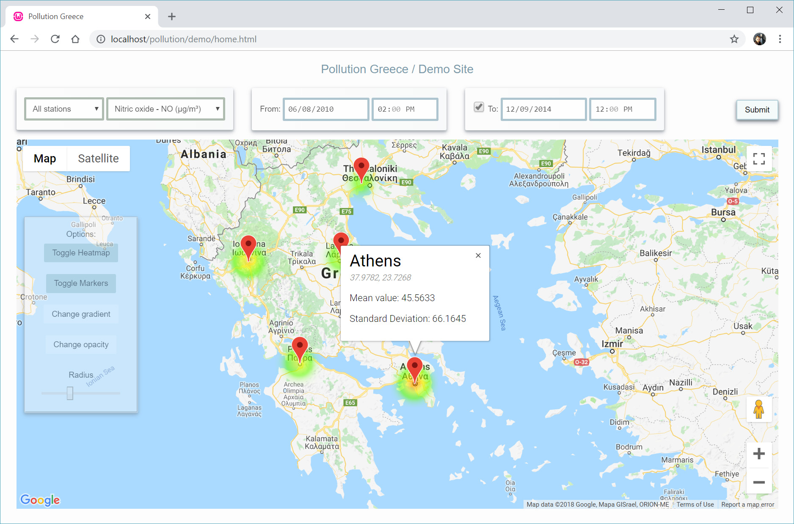
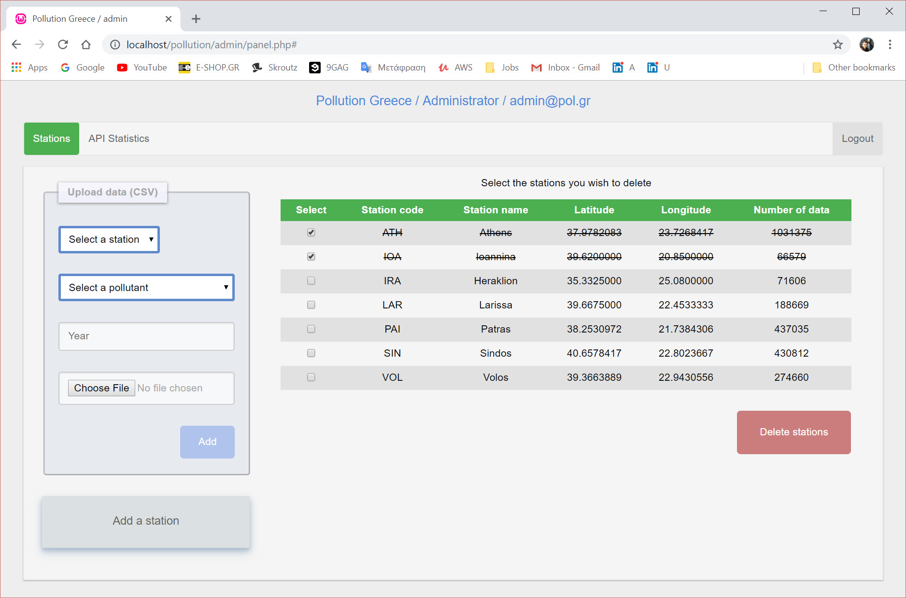

# Pollution Statistics

This project consists of 3 parts:

1. Web API management (admin)
2. API key creation (developer)
3. Demo website (user)

## Web API Management

The web API provides air pollution data based on datasets published by the [Ministry of Environment](http://www.ypeka.gr/?tabid=492).

After logging in the system, the administrator can add / remove an atmospheric pollution monitoring station, or add pollution data to a station for a given reference year.

The administrator can also view usage statistics for the top 10 API keys based on the number of requests.

## API Key Creation

After creating an account, the developer will be provided with a unique API key. Also, statistics about the key's usage will be accessible to the developer.

## Demo Website

The developer can create a demo website which can access the Web API through their unique API key.

The user can then select a date (or a time period), a pollutant and a station (optionally). Statistical data is presented to the user through a heat map and info windows.

## Screenshots

